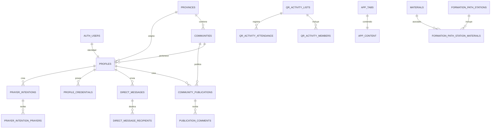

# Esquema canónico de Supabase

Fecha de diseño: 2026-06-13

Issue relacionada: GitHub #21 - Supabase Fase 2.

## 1. Objetivo y límites

Este documento define la estructura estable hacia la que debería converger la base de Palestra APP. Parte del inventario de `docs/supabase/SCHEMA_INVENTORY.md` y de las definiciones SQL existentes en `supabase/`.

Esta fase es exclusivamente de diseño:

- no ejecuta migraciones;
- no elimina ni renombra columnas;
- no cambia código funcional;
- no presupone que todos los parches del repositorio estén aplicados en producción.

Los tipos y restricciones aquí propuestos deben contrastarse con un export real de Supabase antes de crear una migración.

## 2. Estado actual y estado deseado

### Estado actual

- `schema.sql` representa una base inicial, no el estado completo.
- Existen decenas de tablas auxiliares y múltiples redefiniciones de RPC.
- `profiles`, comunidades y contenido mezclan relaciones UUID con nombres en texto.
- Algunos módulos leen tablas directamente y otros acceden a las mismas entidades mediante RPC.
- Hay fallbacks que toleran columnas o firmas antiguas.
- El borrado lógico usa distintos nombres y criterios según el módulo.
- Algunas referencias de usuario apuntan a `profiles(id)` y otras a `auth.users(id)`.

### Estado deseado

- `profiles.id` es el único identificador público de usuario y coincide con `auth.users.id`.
- Las relaciones territoriales usan `province_id` y `community_id`.
- Los textos territoriales legacy se mantienen solo durante la transición.
- Todas las tablas mutables tienen auditoría temporal coherente.
- El borrado lógico usa `archived_at`; los estados funcionales no reemplazan al archivado.
- Las tablas con orden visual usan `sort_order integer not null default 100`.
- Las listas de valores tienen `check`, enum estable o tabla catálogo.
- Las RPC tienen una sola firma vigente y retornos documentados.
- Toda RPC `security definer` usa `set search_path = public`.
- RLS valida permisos reales en base de datos, no decisiones de la UI.

## 3. Convenciones canónicas

### 3.1 Identificadores

- Entidades: `id uuid primary key default gen_random_uuid()`.
- Perfil: `profiles.id uuid primary key references auth.users(id) on delete cascade`.
- Claves foráneas: sufijo `_id`.
- No crear una segunda columna `user_id` dentro de `profiles`.
- Las RPC pueden devolver `user_id` como alias de compatibilidad, pero debe representar `profiles.id`.

### 3.2 Fechas y auditoría

Para tablas mutables:

- `created_at timestamptz not null default now()`.
- `updated_at timestamptz not null default now()`.
- `created_by uuid references profiles(id) on delete set null`, cuando corresponda.
- `updated_by uuid references profiles(id) on delete set null`, cuando corresponda.
- `archived_at timestamptz`, para borrado lógico.

`updated_at` debe mantenerse mediante un trigger común, no manualmente desde cada cliente.

### 3.3 Textos, URLs y datos flexibles

- Texto humano corto: `text` con validación de longitud cuando sea relevante.
- Cuerpo o descripción: `text`.
- URLs: `text`; su validación completa pertenece a RPC/backend.
- Configuración o contenido estructurado: `jsonb not null` con default explícito.
- Colecciones simples: arrays tipados solo cuando no representen entidades relacionadas.

### 3.4 Estados

- `is_active` controla habilitación operativa.
- `status` representa el flujo funcional del registro.
- `archived_at` representa retiro lógico.
- No inferir archivado a partir de `is_active = false`.

### 3.5 Referencias de usuario

Las nuevas claves foráneas deben apuntar a `public.profiles(id)`, excepto integraciones técnicas que requieran explícitamente `auth.users(id)`. La identidad sigue siendo la misma, pero `profiles` es la frontera de dominio de la app.

### 3.6 Rangos y permisos

Durante la migración se conserva `public.user_role`, porque cambiar su tipo rompería tablas, funciones y clientes actuales.

El diseño estable usa:

- `profiles.role public.user_role`;
- `profiles.subrole_key text`;
- `permissions` como catálogo;
- `role_permissions` como relación entre rango y permiso;
- `role_aliases` y `province_role_labels` solo para presentación.

Los subrangos no deben convertirse en nuevos valores de `user_role`.

## 4. Núcleo de identidad y territorio

### 4.1 `provinces`

Propósito: catálogo territorial oficial.

| Columna | Tipo canónico | Obligatoria | Default / regla |
|---|---|---:|---|
| `id` | `uuid` | sí | PK, `gen_random_uuid()` |
| `name` | `text` | sí | único |
| `region` | `text` | sí | región argentina predefinida |
| `logo_url` | `text` | no | `null` |
| `is_active` | `boolean` | sí | `true` |
| `archived_at` | `timestamptz` | no | `null` |
| `created_at` | `timestamptz` | sí | `now()` |
| `updated_at` | `timestamptz` | sí | `now()` |
| `updated_by` | `uuid` | no | FK `profiles(id)`, `on delete set null` |

Restricciones:

- `unique(name)`;
- no permitir edición libre de `name` o `region` desde la app;
- una provincia archivada no debe aparecer en registro ni asignaciones nuevas.

### 4.2 `communities`

Propósito: comunidades pertenecientes a una provincia.

| Columna | Tipo canónico | Obligatoria | Default / regla |
|---|---|---:|---|
| `id` | `uuid` | sí | PK |
| `province_id` | `uuid` | sí | FK `provinces(id)` |
| `name` | `text` | sí | único dentro de provincia |
| `group_type` | `text` | sí | `jovenes`; check de grupos soportados |
| `address` | `text` | sí | cadena no vacía |
| `phone` | `text` | no | `null` |
| `meeting_day` | `text` | no | `null` |
| `meeting_time` | `text` | no | `null` |
| `description` | `text` | no | `null` |
| `image_url` | `text` | no | `null` |
| `latitude` | `double precision` | no | rango `-90..90` |
| `longitude` | `double precision` | no | rango `-180..180` |
| `is_active` | `boolean` | sí | `true` |
| `archived_at` | `timestamptz` | no | `null` |
| `created_at` | `timestamptz` | sí | `now()` |
| `updated_at` | `timestamptz` | sí | `now()` |
| `updated_by` | `uuid` | no | FK `profiles(id)` |

Restricciones:

- `unique(province_id, name)`;
- latitud y longitud deben ser ambas nulas o ambas válidas;
- la provincia padre no debe borrarse físicamente si tiene datos históricos.

### 4.3 `profiles`

Propósito: perfil de dominio asociado uno a uno con Supabase Auth.

| Columna | Tipo canónico | Obligatoria | Default / regla |
|---|---|---:|---|
| `id` | `uuid` | sí | PK y FK `auth.users(id)` |
| `full_name` | `text` | sí | nombre visible |
| `first_name` | `text` | no | compatibilidad con onboarding |
| `last_name` | `text` | no | compatibilidad con onboarding |
| `phone` | `text` | no | `null` |
| `birth_date` | `date` | no | `null` |
| `avatar_url` | `text` | no | `null` |
| `province_id` | `uuid` | no | FK `provinces(id)` |
| `community_id` | `uuid` | no | FK `communities(id)` |
| `managed_community_id` | `uuid` | no | FK `communities(id)` |
| `status` | `user_status` | sí | `pendiente` |
| `role` | `user_role` | sí | `invitado` |
| `subrole_key` | `text` | no | `null` |
| `display_role_label` | `text` | no | presentación, no autorización |
| `gender_preference` | `text` | no | check `male`, `female` |
| `nickname` | `text` | no | `null` |
| `use_nickname_in_greetings` | `boolean` | sí | `false` |
| `credential_name_mode` | `text` | sí | `name`; check `name`, `nickname`, `both` |
| `perseverance_started_on` | `date` | no | fuente canónica de antigüedad |
| `perseverance_start_year` | `integer` | no | compatibilidad temporal |
| `honor_level_id` | `uuid` | no | FK `honor_level_definitions(id)` |
| `personal_pm_type` | `text` | no | check `pmm`, `pmf` |
| `personal_pm_number` | `integer` | no | positivo |
| `personal_pm_province_id` | `uuid` | no | FK `provinces(id)` |
| `personal_pm_motto` | `text` | no | `null` |
| `personal_greeting_color` | `text` | no | `#RRGGBB` o `null` |
| `province_community_changed_at` | `timestamptz` | no | cooldown territorial |
| `last_profile_edit_at` | `timestamptz` | no | auditoría de edición |
| `approved_at` | `timestamptz` | no | `null` |
| `approved_by` | `uuid` | no | FK `profiles(id)` |
| `deleted_at` | `timestamptz` | no | baja lógica de cuenta |
| `created_at` | `timestamptz` | sí | `now()` |
| `updated_at` | `timestamptz` | sí | `now()` |

Reglas:

- si `community_id` no es nulo, su `province_id` debe coincidir con `profiles.province_id`;
- `email` y `email_confirmed_at` tienen como fuente canónica `auth.users`;
- las RPC administrativas pueden proyectar esos campos, pero no deben mantener una copia divergente;
- permisos y alcance se calculan con `role`, `status`, `province_id`, `community_id` y relaciones, nunca con etiquetas visibles.

### 4.4 Catálogos de autorización y presentación

| Tabla | Propósito | Clave / columnas canónicas |
|---|---|---|
| `permissions` | Catálogo de capacidades | `key text PK`, `label`, `description` |
| `role_permissions` | Permisos efectivos por rango | PK `(role, permission_key)`; no necesita `enabled`: ausencia significa deshabilitado |
| `role_aliases` | Etiqueta visible asignable | `id`, `base_role`, `display_label`, `province_id`, `is_active`, auditoría |
| `province_role_labels` | Etiqueta provincial de un rango | `id`, `province_id`, `role_key`, `display_label`, `description`, `is_active`; unique `(province_id, role_key)` |
| `honor_level_definitions` | Nivel honorífico sin alterar rango | `id`, `role_key`, `level_key`, `display_name`, `description`, `min_years`, `sort_order`, `is_active` |

## 5. Configuración, navegación y contenido

### 5.1 Tablas principales

| Tabla | Propósito | Estructura canónica resumida |
|---|---|---|
| `app_runtime_config` | Configuración remota global | `id text PK default 'default'`, versiones, mantenimiento, mensaje, `feature_flags jsonb default {}`, `catholic_news jsonb default {}`, auditoría |
| `app_tabs` | Navegación administrable | `key text PK`, `label`, `icon_name`, `section_type`, `is_visible default true`, `sort_order default 100`, `visible_roles user_role[]` o `text[]`, auditoría |
| `app_content` | Contenido editable por pestaña | `tab_key text PK/FK app_tabs`, `title`, `body`, `blocks jsonb default []`, auditoría |
| `app_library_items` | Oraciones, cancionero e himno | `id`, `section`, `title`, `subtitle`, `body`, `image_url`, `category`, `source`, `item_date`, `status`, `sort_order`, auditoría, `archived_at` |
| `church_document_buttons` | Enlaces de documentos eclesiales | `id`, `title`, `logo_url`, `target_url`, `enabled`, `sort_order`, auditoría, `archived_at` |
| `formation_path_stations` | Estaciones del camino formativo | `id`, textos, imagen/icono/color, `sort_order`, contenido joven/dirigente, `visible_roles`, `is_active`, auditoría, `archived_at` |
| `formation_path_station_materials` | Materiales de una estación | `id`, `station_id`, `material_id`, `sort_order`; unique `(station_id, material_id)` |

Reglas:

- `app_content.blocks` es la fuente canónica de cards editables;
- cada bloque debe tener identificador estable, tipo, contenido opcional, visibilidad y orden;
- `visible_roles` vacío o nulo significa sin restricción adicional;
- `section_type` debe aceptar solo los tipos soportados por el cliente.

## 6. Noticias, agenda, PM y materiales

| Tabla | Columnas canónicas principales |
|---|---|
| `news` | `id`, `title text not null`, `body text not null`, `image_url`, `province_id`, `is_public boolean default true`, `created_by`, `created_at`, `updated_at`, `updated_by`, `archived_at` |
| `events` | `id`, `title`, `description`, `starts_at timestamptz`, `ends_at timestamptz null`, `province_id`, `is_public default true`, auditoría, `archived_at` |
| `motivador_periods` | `id`, `province_id`, `gender`, `pm_number`, `selected_dates date[]`, `starts_on`, `ends_on`, lugar/dirección/horarios, imágenes, visibilidad, `status`, auditoría, `archived_at` |
| `materials` | `id`, `title`, `description`, `category`, `visibility`, `required_permission`, `file_url`, `file_path`, `sort_order`, `province_id`, auditoría, `archived_at` |
| `news_drafts` | `id`, `title`, `body`, `category`, `image_url`, `is_featured`, `status`, `province_id`, `published_news_id`, auditoría |
| `daily_gospel` | `id`, `date unique`, título/cita/texto/reflexión/oración, fuentes, `fetched_at`, auditoría |
| `user_agenda_preferences` | PK `(user_id, item_key, preference_type)`, metadatos de título/fecha/origen, `created_at` |

Decisiones:

- `province_id = null` representa alcance nacional en noticias, eventos y materiales.
- `selected_dates` es la selección real de PM; `starts_on` y `ends_on` se conservan como rango derivado/indexable.
- `file_path` es la referencia canónica de Storage; `file_url` se mantiene mientras existan URLs externas o datos legacy.
- `required_permission` referencia `permissions(key)`.

## 7. Comunidad, foro y consultas

### 7.1 Publicaciones comunitarias

| Tabla | Estructura canónica resumida |
|---|---|
| `community_publications` | `id`, `community_id`, `created_by`, `kind`, `title`, `subtitle`, `body`, `body_format`, imagen/enlace/fecha, `visibility`, opciones/resultados de encuesta, `status`, moderación, auditoría, `archived_at` |
| `publication_comments` | `id`, `publication_id`, `user_id`, `body`, moderación, auditoría, `archived_at` |
| `publication_reactions` | PK `(publication_id, user_id)`, `reaction`, `created_at` |
| `publication_reports` | `id`, publicación o comentario, `reporter_id`, motivo, estado y auditoría |
| `community_poll_votes` | `id`, `publication_id`, `user_id`, `option_text`, `created_at`; unique `(publication_id, user_id)` |

`poll_results` puede mantenerse como caché derivada, pero la fuente canónica de votos es `community_poll_votes`.

### 7.2 Foro

| Tabla | Estructura canónica resumida |
|---|---|
| `forum_categories` | `id`, `scope`, `province_id`, `name`, `description`, `sort_order`, `is_active`, `created_at`; unique `(scope, province_id)` |
| `forum_topics` | `id`, `category_id`, `author_id`, `title`, `body`, `min_role`, `author_role`, `status`, cierre, auditoría, `archived_at` |
| `forum_comments` | `id`, `topic_id`, `author_id`, `body`, `author_role`, auditoría, `archived_at` |

### 7.3 Consultas públicas y contacto

`public_queries` es el modelo canónico para consultas institucionales.

Columnas:

- `id uuid PK`;
- remitente autenticado opcional y datos de contacto;
- `message`;
- `destination_type`;
- `origin`;
- `community_id`, `province_id` y `target_user_id` opcionales;
- `status`, respuesta y responsable;
- tiempos de lectura, respuesta y archivo;
- `legacy_message_id` durante la transición.

`community_contact_messages` debe mantenerse como compatibilidad hasta migrar formularios y datos. No debe recibir funcionalidades nuevas.

## 8. Mensajería, moderación y notificaciones

### 8.1 Mensajería canónica

| Tabla | Propósito |
|---|---|
| `direct_messages` | Cabecera y cuerpo enviado por un usuario |
| `direct_message_recipients` | Destinatarios, lectura y borrado individual |
| `message_reports` | Reportes de mensajes directos o legacy |
| `moderation_rules` | Reglas activas de prevención |
| `moderation_events` | Auditoría de decisiones automáticas/manuales |
| `user_messaging_restrictions` | Restricciones temporales o permanentes |

`internal_messages` y los campos de buzón de `community_contact_messages` se consideran legacy. Deben conservarse hasta migrar historial y consumidores.

### 8.2 Notificaciones

| Tabla | Estructura canónica resumida |
|---|---|
| `device_push_tokens` | `id`, `user_id`, token único, plataforma/dispositivo/versión, `is_active`, actividad y auditoría |
| `notification_intents` | `id`, creador, tipo, título/cuerpo, destino estructurado, origen, payload, estado, contadores, errores y tiempos |

La Edge Function procesa `notification_intents`; crear la intención no equivale a entrega confirmada.

## 9. QR, intenciones y asignaciones

### 9.1 Credenciales y listas QR

| Tabla | Estructura canónica resumida |
|---|---|
| `profile_credentials` | `id`, `user_id`, token único, versión, emisión, vencimiento, revocación, creación |
| `qr_activity_lists` | `id`, título, `province_id`, `community_id`, creador, estado y auditoría |
| `qr_activity_members` | `id`, lista, usuario, quién agregó y fecha; unique `(list_id, user_id)` |
| `qr_activity_attendance` | `id`, lista, usuario, validador y fecha; unique `(list_id, user_id)` |
| `qr_activity_list_shares` | `id`, lista, usuario o rango destinatario, creador y fecha |

El QR contiene un token opaco, nunca nombre, email ni rango. `province` y `community_name` de `qr_activity_lists` se mantienen temporalmente mientras se incorporan las claves UUID.

### 9.2 Intenciones

| Tabla | Estructura canónica resumida |
|---|---|
| `prayer_intentions` | autor, cuerpo, anonimato público, contador derivado, auditoría y archivo |
| `prayer_intention_prayers` | intención, usuario y fecha |
| `prayer_intention_removal_notices` | usuario, intención, mensaje, visto y fecha |

La identidad del autor siempre existe en base aunque la presentación sea anónima.

### 9.3 Asesores y jerarquías

| Tabla | Propósito |
|---|---|
| `community_advisors` | Asignación histórica de asesores a comunidades |
| `profile_role_relationships` | Relaciones dirigenciales explícitas cuando territorio/rango no alcanzan |
| `province_community_sections` | Habilitación de grupos por provincia |

## 10. Relaciones esperadas

## 11. Campos de compatibilidad

### Mantener durante la transición

| Campo / estructura | Fuente canónica | Motivo |
|---|---|---|
| `profiles.province` | `profiles.province_id -> provinces.name` | RPC y clientes históricos |
| `profiles.community_name` | `profiles.community_id -> communities.name` | filtros y visualización existentes |
| `profiles.perseverance_start_year` | `perseverance_started_on` | formularios y cálculo anterior |
| `profiles.pm_motto` | `personal_pm_motto` | nombres duplicados históricos |
| RPC que retornan `user_id` | `profiles.id` | contrato actual de QR/usuarios |
| `materials.file_url` | `file_path` o URL externa | datos ya publicados |
| `qr_activity_lists.province` | `province_id` | alcance legacy por texto |
| `qr_activity_lists.community_name` | `community_id` | alcance legacy por texto |
| `community_contact_messages` | `public_queries` / mensajería directa | historial y formulario antiguo |
| `internal_messages` | mensajería directa + notificaciones | historial |
| `poll_results` | `community_poll_votes` | caché de lectura |

Estos campos deben sincronizarse en base mediante una única capa temporal. No deben depender de que cada pantalla escriba ambas representaciones.

## 12. Campos reemplazables o eliminables en el futuro

Solo después de migrar datos, RPC y clientes:

- `profiles.province`;
- `profiles.community_name`;
- `profiles.perseverance_start_year`;
- `profiles.pm_motto`;
- cualquier `profiles.email` persistido fuera de Auth;
- `qr_activity_lists.province`;
- `qr_activity_lists.community_name`;
- `community_contact_messages`, cuando no tenga consumidores;
- `internal_messages`, después de migrar historial;
- `community_news`, si todo su contenido está en `community_publications`;
- columnas `sender_deleted_at`/`recipient_deleted_at` legacy cuando cada participante use su tabla de relación;
- firmas antiguas de RPC sin imágenes, grupo comunitario o campos nuevos.

No eliminar `display_role_label`, `role_aliases` o `province_role_labels`: son presentación válida, siempre que no controlen permisos.

## 13. Índices mínimos esperados

- `profiles(status, role, province_id, community_id)` con filtro `deleted_at is null`.
- `communities(province_id, is_active, name)` con filtro `archived_at is null`.
- `news(province_id, created_at desc)` con filtro `archived_at is null`.
- `events(province_id, starts_at)` con filtro `archived_at is null`.
- `materials(province_id, visibility, sort_order)` con filtro `archived_at is null`.
- `community_publications(community_id, visibility, created_at desc)` con filtro `archived_at is null`.
- `publication_comments(publication_id, created_at)`.
- `direct_messages(sender_id, created_at desc)`.
- `direct_message_recipients(recipient_id, read_at, created_at desc)`.
- `notification_intents(status, created_at)`.
- `device_push_tokens(user_id, is_active)`.
- `profile_credentials(token)` unique y `(user_id, revoked_at, expires_at)`.
- `qr_activity_members(list_id, user_id)` unique.
- `prayer_intention_prayers(intention_id, created_at)`.

Los índices definitivos deben validarse con `pg_stat_statements` o consultas reales antes de agregarlos.

## 14. Contrato canónico de RPC

Cada RPC pública debe cumplir:

1. una sola firma vigente;
2. parámetros con prefijo `p_`;
3. tipos explícitos y defaults documentados;
4. retorno estable, preferentemente `returns table` para lecturas y UUID/void para mutaciones;
5. `security definer set search_path = public` cuando eleve privilegios;
6. validación de `auth.uid()`, estado, rango y alcance territorial;
7. nombres de salida no ambiguos frente a columnas internas;
8. grants explícitos para `anon`, `authenticated` o `service_role`;
9. pruebas de autorización y de datos nulos;
10. versión nueva o `drop function` explícito cuando cambie la firma.

## 15. Plan de migración gradual

### Paso 0 - Congelar y respaldar

- Exportar esquema, funciones, policies y datos de producción.
- Registrar checksums y fecha del backup.
- Prohibir ejecución manual de parches históricos durante la migración.
- Preparar ambiente de staging con copia anonimizada.

Criterio de salida: restauración comprobada en staging.

### Paso 1 - Medir diferencias

- Comparar el export real con este documento y `SCHEMA_INVENTORY.md`.
- Clasificar cada columna como existente, faltante, divergente o legacy.
- Identificar RPC duplicadas por firma y versión.
- Inventariar filas huérfanas y textos territoriales sin correspondencia.

No modificar datos en este paso.

### Paso 2 - Agregar estructura compatible

- Agregar únicamente columnas nuevas, tablas catálogo, claves foráneas inicialmente tolerantes e índices no destructivos.
- Incorporar `updated_at`, `archived_at` y auditoría faltante.
- Agregar `province_id`/`community_id` donde hoy solo hay texto.
- No establecer `not null` hasta completar backfill.

Las migraciones deben ser idempotentes y transaccionales cuando sea posible.

### Paso 3 - Backfill territorial e identidad

- Resolver `profiles.province` contra `provinces.name`.
- Resolver `profiles.community_name` dentro de su provincia.
- Resolver textos de listas QR y otros módulos hacia UUID.
- Marcar conflictos para revisión manual; nunca elegir por coincidencia ambigua.
- Confirmar que `profiles.id = auth.users.id`.

Generar reportes de filas migradas, omitidas y conflictivas.

### Paso 4 - Escritura doble centralizada

- Actualizar RPC de escritura para recibir/usar IDs canónicos.
- Mantener textos legacy sincronizados desde base.
- Evitar escritura doble en componentes React.
- Instrumentar errores y comparar valores canónicos/legacy.

Criterio de salida: ninguna divergencia nueva durante un período de observación.

### Paso 5 - Consolidar RPC

Orden recomendado:

1. perfil y usuarios;
2. provincias y comunidades;
3. contenido, noticias, agenda y PM;
4. buzón, consultas y moderación;
5. QR, intenciones y notificaciones.

Por cada RPC:

- elegir firma canónica;
- crear pruebas;
- reemplazar versión vigente;
- mantener wrapper temporal si el cliente antiguo aún existe;
- retirar redefiniciones históricas del orden activo.

### Paso 6 - Migrar lecturas

- Cambiar consultas y RPC para leer relaciones UUID.
- Eliminar fallbacks uno por uno, nunca todos juntos.
- Registrar error de esquema en lugar de convertirlo silenciosamente en lista vacía.
- Verificar localhost y dispositivo real.

### Paso 7 - Endurecer restricciones

Cuando el backfill sea completo:

- establecer `not null` requerido;
- agregar checks y claves foráneas definitivas;
- validar uniques;
- activar índices definitivos;
- consolidar triggers de `updated_at`;
- revisar RLS y grants por módulo.

Usar `not valid` y `validate constraint` cuando reduzca bloqueos.

### Paso 8 - Retirar compatibilidad

- Confirmar que ninguna versión soportada de la app usa campos legacy.
- detener sincronización doble;
- archivar wrappers RPC antiguos;
- eliminar columnas solo en una issue/migración separada;
- conservar vistas de compatibilidad si existen consumidores externos.

### Paso 9 - Snapshot y operación

- Generar `supabase/schema_current.sql` desde la base consolidada.
- Documentar orden único de migraciones.
- Separar scripts normales, históricos y de emergencia.
- Añadir verificación automática del contrato en CI.

## 16. Estrategia de reversión

Cada paso debe poder revertirse sin restaurar toda la base:

- columnas nuevas permanecen nulas si se desactiva la migración;
- escritura doble puede apagarse manteniendo campos legacy;
- RPC anterior se conserva con nombre/versionado temporal;
- restricciones se agregan después del período de observación;
- eliminaciones físicas quedan fuera de la primera migración;
- todo backfill guarda reporte y permite reconstruir el valor anterior.

## 17. Criterios para considerar canónico el esquema

El esquema será estable cuando:

- una instalación nueva pueda construirse sin parches manuales;
- todas las RPC usadas por una versión soportada estén definidas una sola vez;
- no existan fallbacks por columnas ausentes;
- no haya divergencias entre IDs territoriales y textos legacy;
- las políticas RLS tengan pruebas de acceso positivo y negativo;
- el snapshot y las migraciones produzcan la misma estructura;
- staging y producción pasen la misma batería de contrato.

## 18. Próxima fase recomendada

La próxima fase no debería aplicar todavía este diseño completo. Debe generar un reporte de diferencias contra un export real de Supabase y convertir el plan en migraciones pequeñas, comenzando por identidad y territorio, que son la dependencia común de casi todos los módulos.
